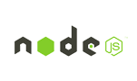
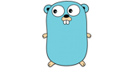

Bilgilendirme
======

Iyzico API sistemini kullanmak istiyorsanız öncelikle yazdığınız programlama dile uygun bir kütüphane kullanmanız gerekiyor. Benim yazdığım golang client i dışında iyzico nun desteklediği clientler aşağıda listelenmiştir.

       

Eğer yukarıdakileri kullanmak istemiyor ve kendiniz yazmak istiyorsanız aşağıdaki endpointlere gerekli istekleri atmanız gerekiyor. Ancak bu dökümanı hazırladığım tarihte resmi olarak yayınlanmış bir API dökümantasyonu yok. O yüzden iyzico da çalışan [Kurtuluş Şahin](https://github.com/kurtulussahin) den aldığım bilgiler  ile bu dökümantasyonu yazdım. Eksik şeyler olabilir. Yanlış yazma ihtimalim de var. **Kesinlikle resmi dökümantasyon değildir.**

Endpoints
======

[BIN CHECK](./endpoints/bin-check.md)
[INSTALLMENT CHECK](./endpoints/installment.md)